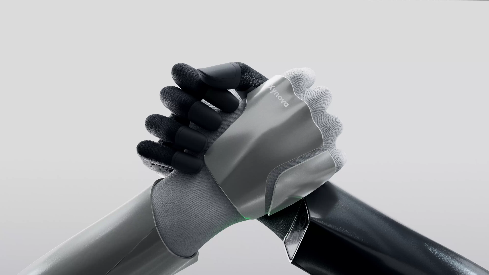
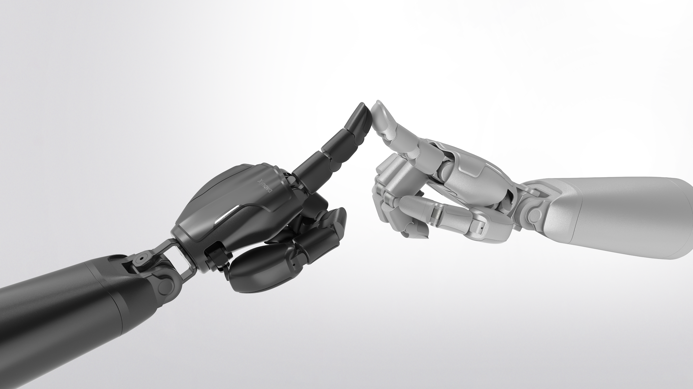
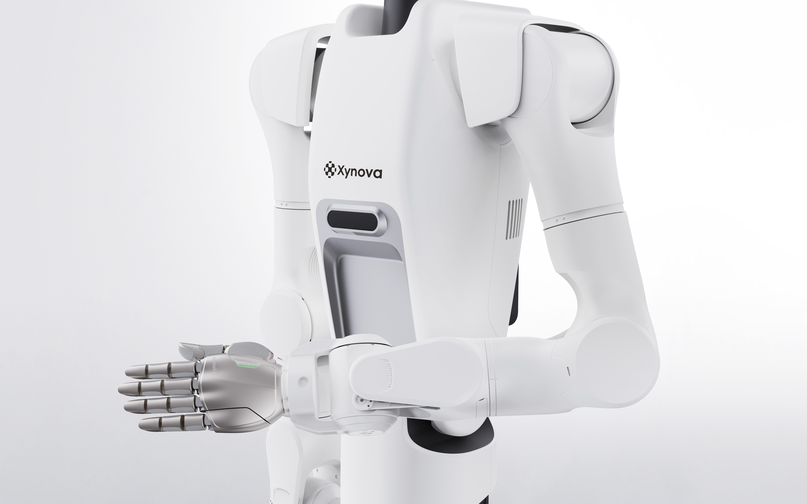

# Xynova

**High-performance dexterous hands and arm-hand systems for embodied AI.**

---

## 🖐️ Products

<table>
  <tr>
    <td width="33%" align="center" valign="top">
      <a href="https://github.com/xynova-tech/Flex2">
         
        <b>Flex 2</b>
      </a>
       <i>Bionic Versatility, Intelligent Stability.</i>
       Dexterous Hand · 23 DoF
       
      <a href="https://github.com/xynova-tech/Flex2">Repository</a> · <a href="https://github.com/xynova-tech/Flex2/releases">Downloads</a>
    </td>
    <td width="33%" align="center" valign="top">
      <a href="https://github.com/xynova-tech/Prima1">
         
        <b>Prima 1</b>
      </a>
       <i>Direct-Drive Transparency, Intelligent Sensing Without Boundaries.</i>
       Direct-Drive Dexterous Hand
       
      <a href="https://github.com/xynova-tech/Prima1">Repository</a> · <a href="https://github.com/xynova-tech/Prima1/releases">Downloads</a>
    </td>
    <td width="33%" align="center" valign="top">
      <a href="https://github.com/xynova-tech/Synca-XFS">
         
        <b>Synca XFS</b>
      </a>
       <i>Native Arm-Hand, Boundless Dexterity.</i>
       Integrated Arm-Hand System
       
      <a href="https://github.com/xynova-tech/Synca-XFS">Repository</a> · <a href="https://github.com/xynova-tech/Synca-XFS/releases">Downloads</a>
    </td>
  </tr>
</table>

## 📦 Repositories

| Repository | Description |
|------------|-------------|
| [`Flex2`](https://github.com/xynova-tech/Flex2) | Flex 2 dexterous hand — Studio software, C++ SDK, and simulation assets |
| [`Prima1`](https://github.com/xynova-tech/Prima1) | Prima 1 dexterous hand — direct-drive SDK, examples, and documentation |
| [`Synca-XFS`](https://github.com/xynova-tech/Synca-XFS) | Synca XFS arm-hand integrated system — unified C++/C SDK and tooling |

## 🚀 Getting Started

1. **Pick your product** — open its repository above
2. **Read the manuals** — user manuals (PDF) are available in each repository
3. **Download software** — SDK, Studio, and simulation packages are published under **Releases** in each repository

## 📬 Contact

- 🌐 **Website** — [www.xynova.com.cn](https://www.xynova.com.cn/)
- ✉️ **Technical support** — [contact-us@xynova.tech](mailto:contact-us@xynova.tech)

© Xynova — Building the future of dexterous manipulation.

